# 🍽️ Yirgu's Kitchen

A full-stack **Food Ordering System** built with **HTML, CSS, JavaScript, Bootstrap, React, and Django**.  
This application allows users to explore and order food seamlessly, while providing administrators with powerful tools to manage orders, food items, and business analytics.

---

## 🚀 Overview

**Yirgu's Kitchen** is designed to simulate a real-world food delivery platform.  
It includes both **user-facing features** and an **admin dashboard** with advanced metrics and order tracking.

---

## ✨ Features

### 👤 User Functionality
- Register and log in to an account  
- Explore available food items  
- Filter foods by category, price, and other criteria  
- Add food items to wishlist  
- Submit reviews and ratings  
- Place orders  
- Track order status in real time  

---

### 🛠️ Admin Functionality
- Add and manage food categories  
- Add, update, and delete food items  
- Track and manage orders by status:
  - Not Confirmed  
  - Confirmed  
  - Being Prepared  
  - Food Pickup  
  - Delivered  
  - Cancelled  
  - All Orders  

---

### 📊 Dashboard & Analytics

The admin dashboard includes **real-time metrics cards** such as:

- Total Orders  
- New Orders  
- Confirmed Orders  
- Food Being Prepared  
- Food Pickup  
- Food Delivered  
- Cancelled Orders  
- Total Users  
- Today's Sales  
- Weekly Sales  
- Monthly Sales  
- Yearly Sales  
- Total Categories  
- Total Wishlists  
- Total Reviews  

📈 Interactive charts are also included to visualize:
- Sales trends  
- Order distribution  
- Business performance over time  

---

## 🧰 Technologies Used

### Frontend
- HTML  
- CSS  
- JavaScript  
- Bootstrap  
- React  

### Backend
- Django  

### Database
- SQLite 

---

## 📸 Screenshots

### 🛠️ Admin Dashboard (1–11)

<p align="center">
  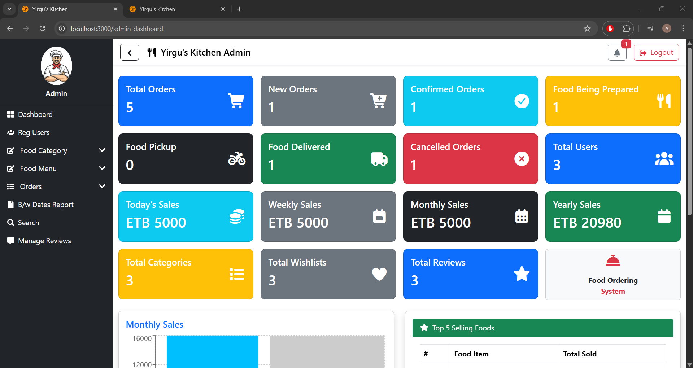
  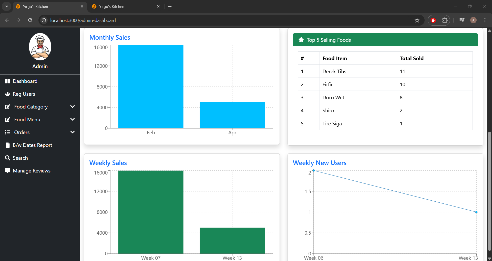
  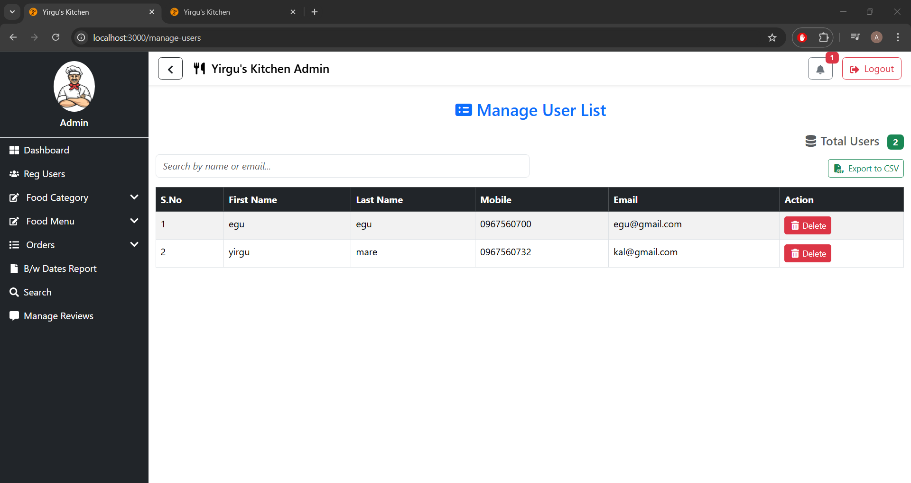
  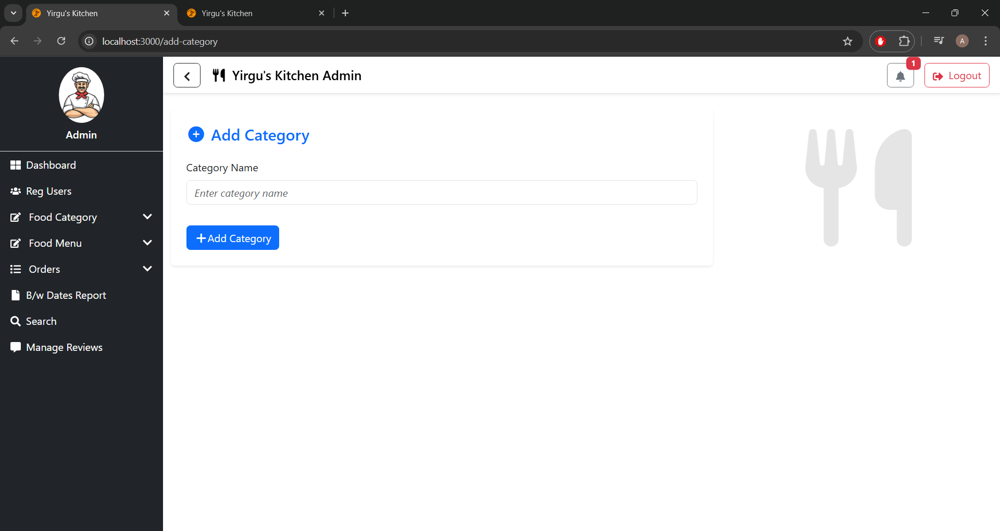
  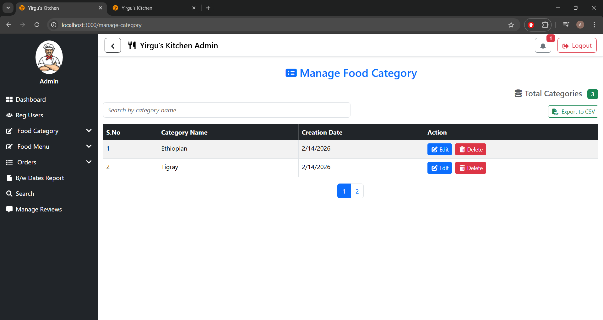
  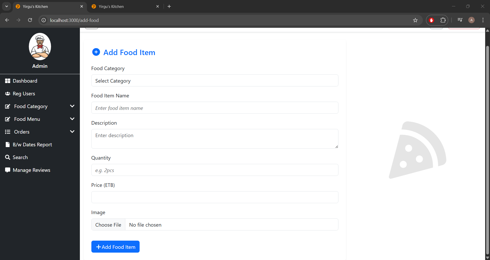
  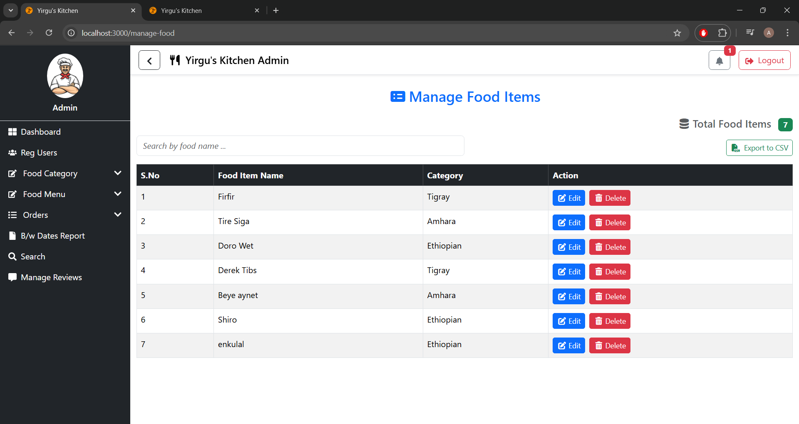
  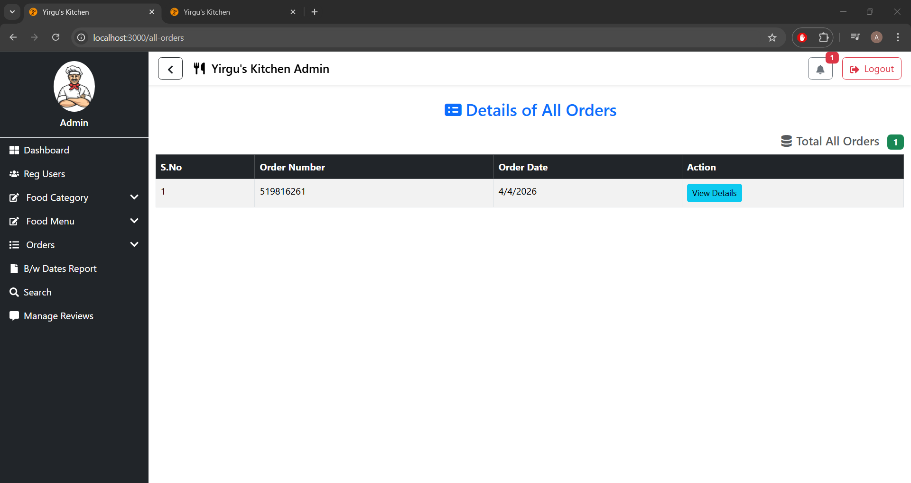
  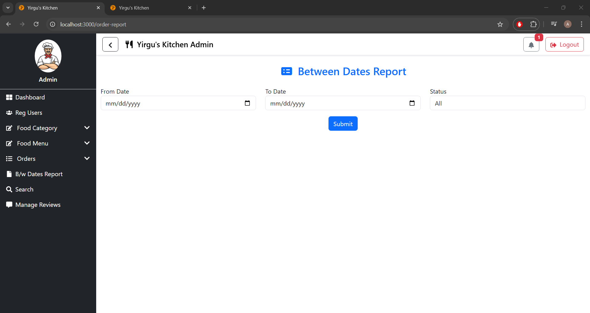
  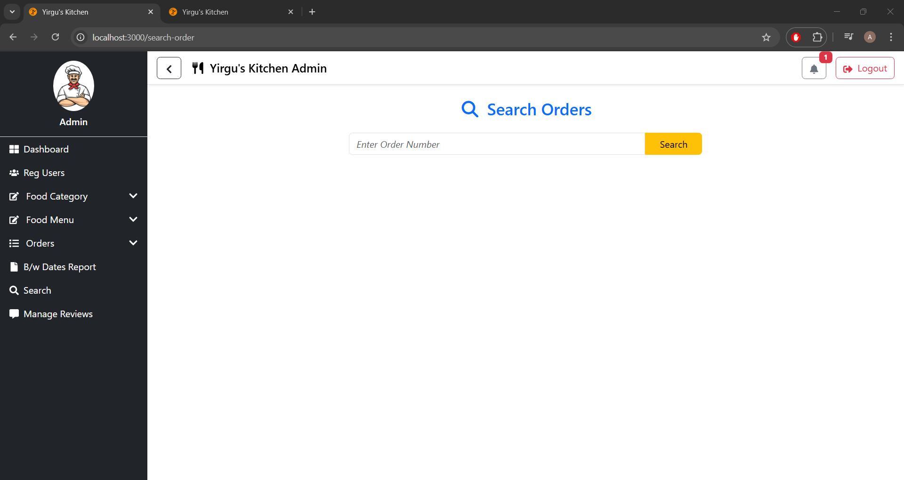
  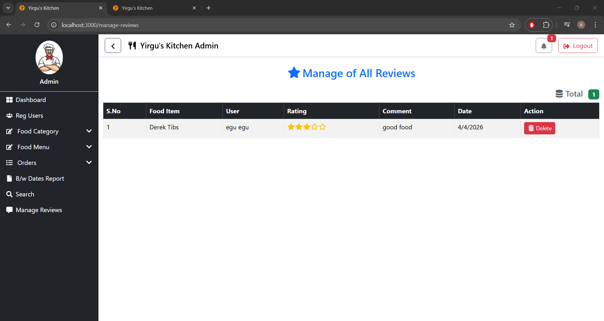
</p>

---

### 👤 User Interface (12–19)

<p align="center">
  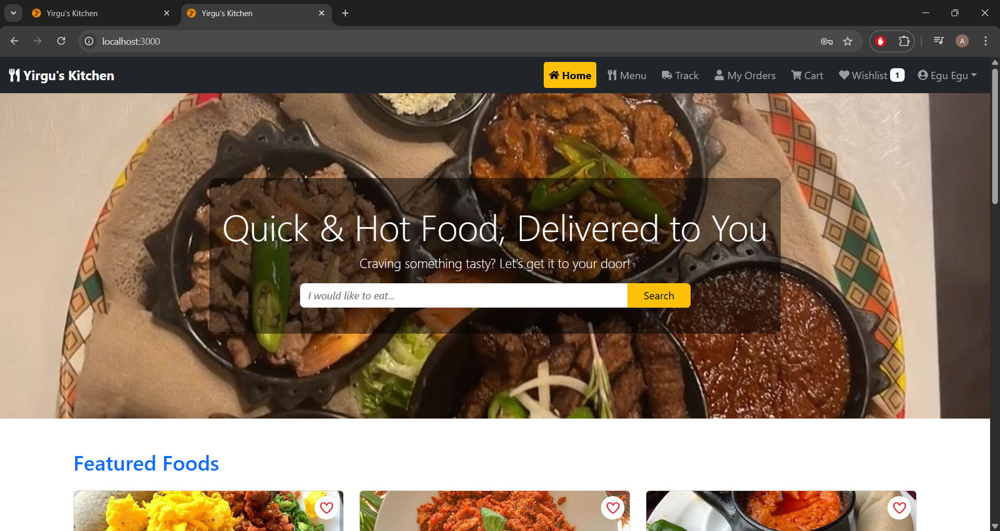
  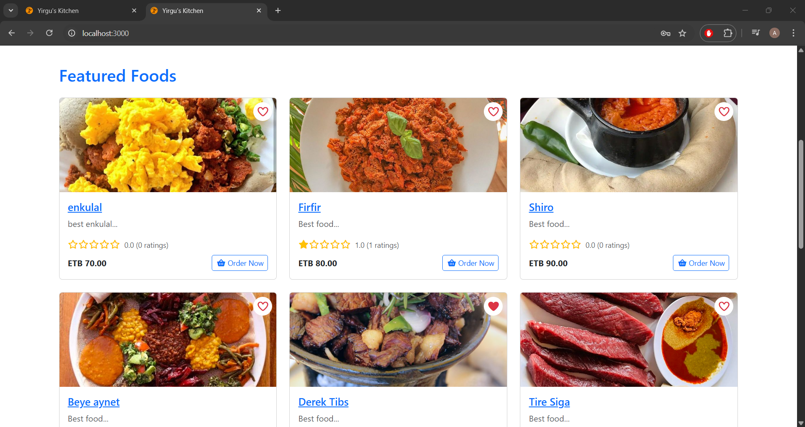
  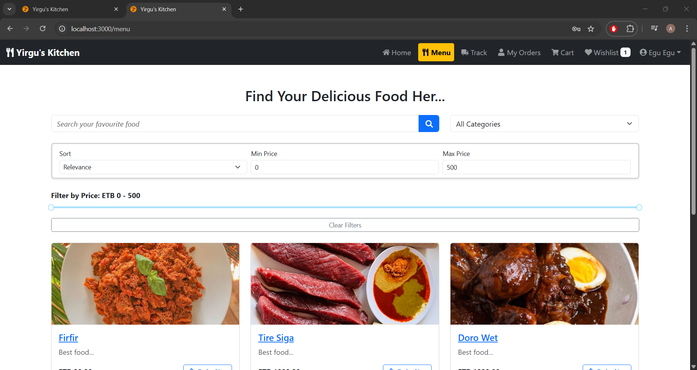
  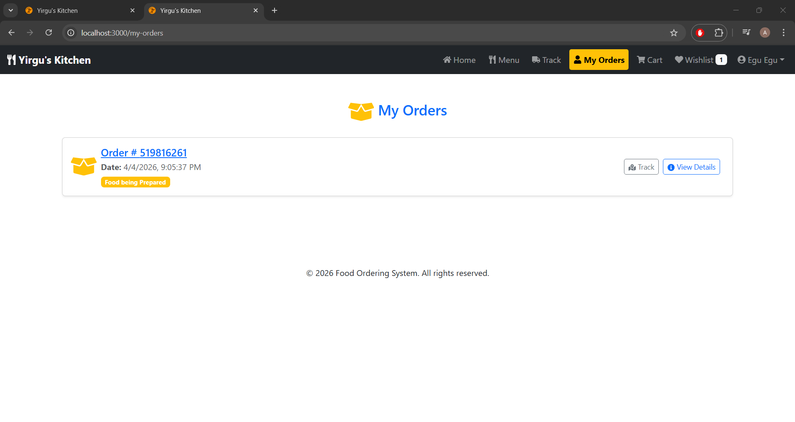
  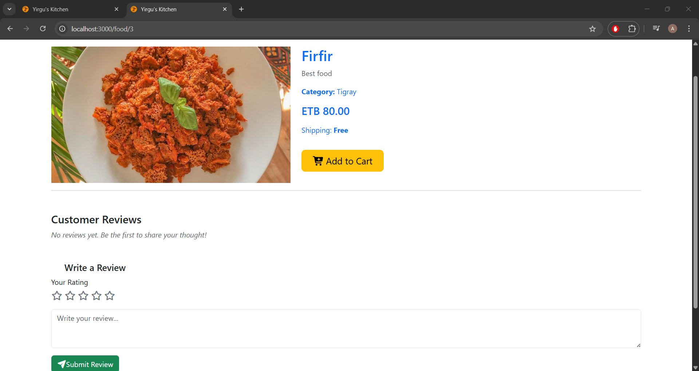
  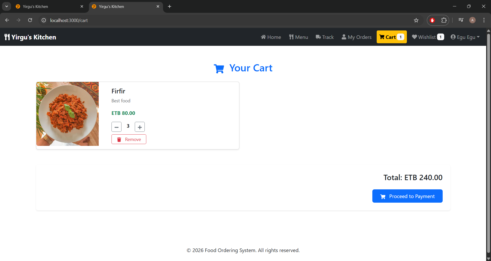
  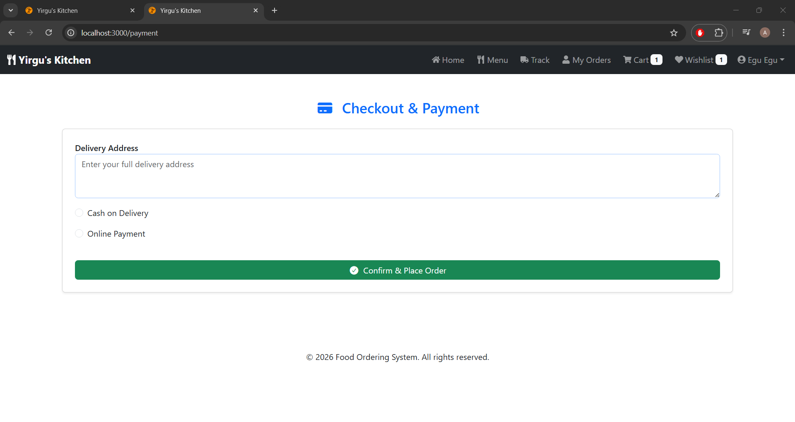
  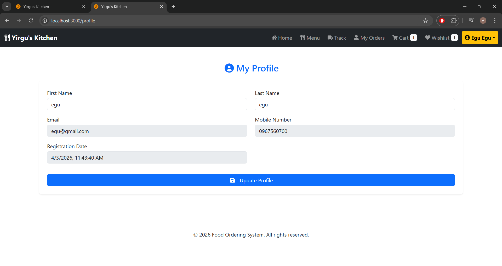
</p>

---

## 📁 Project Structure

```
YirgusKitchen/
│── backend/          # Django backend
│── frontend/         # React frontend
│── screenshots/      # Project images
│── README.md
```

---

## 🔐 Key Highlights

- Full-stack architecture (React + Django)  
- Real-time order tracking system  
- Advanced admin analytics dashboard  
- Clean and responsive UI  
- Scalable structure for future improvements  

---

## 🚧 Future Improvements

- Payment integration  
- Real-time notifications (WebSockets)  
- Mobile app version  
- Multi-vendor support  

---

## 👨‍💻 Author

**Kalab**

---

## ⭐ Support

If you like this project, consider giving it a ⭐ on GitHub!